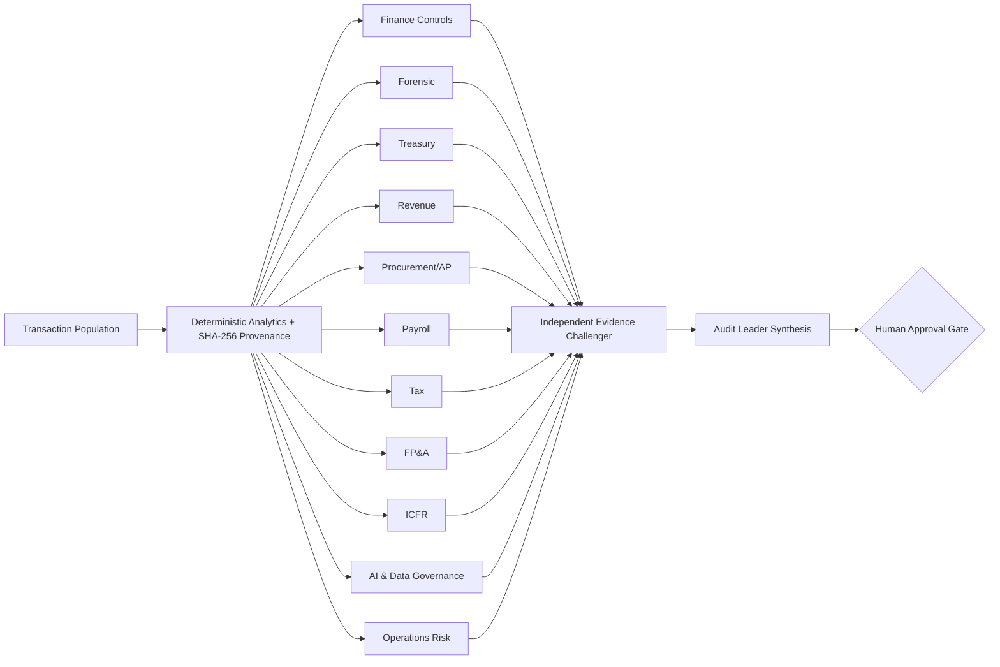

# FRANKENSTEIN Audit Architecture

**FRANKENSTEIN** is the working codename for a modular Finance & Operations Audit System assembled from replaceable specialist agents, deterministic tests, independent challenge, and a mandatory human decision gate.

The name is intentionally architectural: the system is composed from specialized "organs" that can be upgraded independently while a common evidence contract keeps the whole system auditable.

## Core pipeline

## Why this is stronger than one large agent

1. **Deterministic evidence first.** Transaction-level claims originate in reproducible Python tests rather than model inference.
2. **Domain separation.** Specialists reason only within assigned domains and receive domain-routed evidence.
3. **Independent challenge.** A separate agent is instructed to falsify, narrow, or reject claims that outrun the evidence.
4. **Programmatic evidence governance.** Unsupported finding IDs are removed after model output; this is enforced in Python, not merely requested in a prompt.
5. **Provenance.** Every run records a SHA-256 hash of the source population.
6. **Fail-closed decision rights.** The system always ends at a pending human gate. It never auto-issues an audit opinion or finding of fraud.
7. **Replaceability.** A treasury, payroll, tax, or ICFR specialist can be improved independently without rewriting the entire pipeline.

## Specialist organs

| Domain | Primary audit lens |
|---|---|
| Finance Controls | Authorization, classification, transaction integrity, reporting controls |
| Forensic | Anomalies, duplicate processing, control circumvention indicators |
| Treasury | Cash disbursements, liquidity, high-value payments, bank-control dependencies |
| Revenue | Validity, credits/reversals, cutoff and revenue evidence requirements |
| Procurement / AP | Procure-to-pay, vendor, approval, duplicate-payment and SoD risk |
| Payroll | Payroll and people-cost controls; abstains when payroll evidence is absent |
| Tax | Tax-process implications and required corroboration |
| FP&A | Budget attribution, unusual spend, variance and management reporting |
| ICFR | Financial-reporting control objectives and control evidence |
| AI & Data Governance | Data quality, lineage, provenance, AI-use boundaries |
| Operations Risk | Resilience, accountability, scalability and third-party dependencies |

## Deterministic finding contract

Each deterministic finding contains:

- stable `finding_id`;
- rule identifier;
- severity;
- affected transaction IDs;
- row-level evidence;
- rationale;
- routed risk domains;
- control objectives.

Model outputs may cite these finding IDs, but they cannot manufacture new deterministic evidence IDs.

## Human gate

The final report is deliberately not a final professional conclusion. Human approval is required to:

- corroborate source documents;
- validate process/control design;
- calibrate materiality and thresholds;
- resolve challenged claims;
- determine whether an observation rises to a reportable audit issue.

## Research status

This is a public research and portfolio prototype. It is not production assurance software and must not be used as a substitute for professional judgment.
