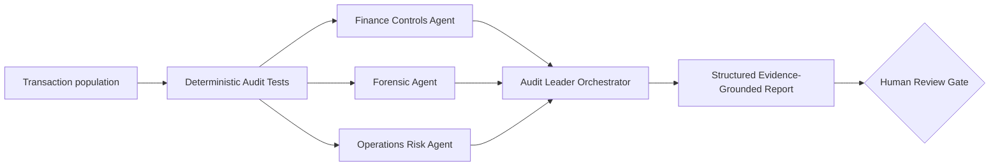

# Finance & Operations Audit Agent

A public research prototype for **AI-assisted internal audit, finance controls, forensic transaction analysis, operations risk, and evidence-based reporting**.

This module was designed around the capabilities described in OpenAI's **Finance & Operations Audit Leader** role. It is an independent portfolio project and is **not affiliated with, endorsed by, or built for OpenAI**.

## Why this prototype exists

Modern internal audit needs more than a chatbot. A credible system should combine:

- deterministic transaction tests;
- audit and accounting domain reasoning;
- forensic anomaly interpretation;
- operational-risk context;
- traceable evidence;
- explicit limitations;
- human approval before material conclusions.

This prototype therefore separates **reproducible testing** from **LLM synthesis**.

## Architecture



## Current capabilities

| Audit need | Prototype capability |
|---|---|
| Risk-based audit testing | Population-level rule tests and risk scoring |
| Financial controls | Missing approval, segregation-of-duties, duplicate-ID tests |
| Forensic review | Amount anomalies, unusual timing, large round-value transactions |
| Operations risk | Process and governance interpretation through specialist agent |
| Data analytics | Full CSV population analysis instead of sample-only inspection |
| Evidence traceability | Finding IDs, rule IDs, transaction IDs, row-level evidence |
| AI-assisted reporting | Structured executive summary, key risks, actions, limitations |
| Human accountability | Final schema requires a human-review flag |

## Repository layout

```text
finance_ops_audit_agent/
├── README.md
├── JOB_ROLE_MAPPING.md
├── analytics.py
├── agent.py
├── cli.py
├── schemas.py
├── requirements.txt
├── .env.example
├── sample_data/
│   └── transactions.csv
└── tests/
    └── test_analytics.py
```

## Quick start

From the repository root:

```bash
python -m venv .venv
source .venv/bin/activate        # Windows: .venv\Scripts\activate
pip install -r finance_ops_audit_agent/requirements.txt
```

Run the transparent tests without any model/API call:

```bash
python -m finance_ops_audit_agent.cli --deterministic-only
```

Run the multi-agent workflow:

```bash
export OPENAI_API_KEY="YOUR_KEY"
python -m finance_ops_audit_agent.cli \
  --csv sample_data/transactions.csv \
  --objective "Assess transaction-control risk and identify evidence requiring follow-up."
```

The model can be changed with:

```bash
export OPENAI_MODEL="gpt-5.6-sol"
```

## Deterministic control and forensic tests

The current prototype checks for:

1. duplicate transaction identifiers;
2. missing approvers;
3. requester/approver segregation-of-duties conflicts;
4. weekend postings;
5. out-of-hours postings;
6. robust amount outliers using median absolute deviation;
7. large round-value transactions.

These are **risk indicators**, not proof of fraud, error, or control failure.

## Agent design

### Finance Controls Auditor
Focuses on authorization, segregation of duties, transaction integrity, accounting-process risk, and evidence sufficiency.

### Forensic Transaction Analyst
Focuses on unusual transactions and fraud indicators while explicitly separating suspicion from proven misconduct.

### Operations Risk Auditor
Focuses on process resilience, governance, scalability, accountability, and what additional evidence is required.

### Finance & Operations Audit Leader Agent
Orchestrates the specialists and produces a structured report with:

- executive summary;
- scope;
- key risks;
- evidence references;
- recommended actions;
- limitations;
- mandatory human-review indicator.

## Safety and audit-governance boundaries

The prototype intentionally does **not**:

- issue an audit opinion;
- determine that fraud occurred;
- accuse an employee, vendor, or counterparty of misconduct;
- claim regulatory compliance;
- make autonomous accounting entries or control changes;
- read files outside this module through its transaction-analysis tool.

Any material conclusion requires corroborating evidence and qualified human review.

## How this can be extended

A production-oriented research roadmap could add:

- general-ledger, AP, AR, payroll, procurement, treasury, tax, and revenue adapters;
- ERP/API ingestion;
- continuous-control monitoring;
- entity-specific materiality thresholds;
- vendor-master and user-access analytics;
- journal-entry models;
- graph-based related-party and payment-flow analysis;
- audit issue lifecycle and remediation validation;
- data lineage, model-risk, access-governance, and AI-control testing;
- board/audit-committee reporting;
- evaluation sets for false positives, false negatives, calibration, and evidence completeness.

## References

- OpenAI Careers: Finance & Operations Audit Leader  
  https://openai.com/careers/finance-and-operations-audit-leader-san-francisco/
- OpenAI Agents SDK  
  https://openai.github.io/openai-agents-python/

## Status

**Research prototype · portfolio demonstration · not production assurance software.**
