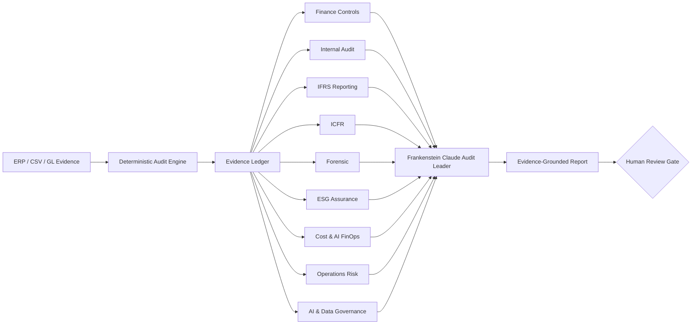

# Frankenstein Claude Architecture

## Design objective

Frankenstein Claude is a research prototype for combining deterministic audit evidence with multiple Claude-based accounting and assurance specialists while preserving explicit human decision rights.

## Pipeline

## Architectural rules

1. Deterministic tests run before generative interpretation.
2. Specialist agents receive the same traceable evidence snapshot.
3. A specialist may request more evidence but may not invent it.
4. Agent consensus is not professional evidence.
5. Fraud, compliance, audit-opinion, and material-weakness conclusions remain human decisions.
6. Model choice is replaceable through `CLAUDE_MODEL`.
7. A missing API key degrades safely to deterministic/offline mode.
8. The public prototype uses synthetic data and does not require confidential client information.

## Planned adapters

- general ledger and journal entries
- revenue and contract data
- procurement / AP / vendor master
- payroll
- treasury and bank evidence
- tax reconciliations
- XBRL / financial statements
- sustainability metrics and source evidence
- access logs and model/agent telemetry
- remediation and issue lifecycle evidence
