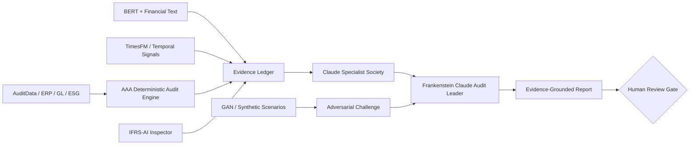

# Frankenstein Claude — Saeid Homayoun GitHub Integration Map

Frankenstein Claude is designed as an **orchestration layer across the strongest accounting, audit and AI assets in the Saehon GitHub portfolio**.

The design intentionally distinguishes between:

- **executable dependency** — code is currently called by Frankenstein Claude;
- **adapter boundary** — a defined future integration role without claiming live code integration;
- **reference only** — useful implementation reference, not imported;
- **governance reference** — architectural/scientific principles.

| GitHub asset | Frankenstein role | Status |
|---|---|---|
| `Saehon/AAA` Finance & Operations Audit Agent | deterministic tests + evidence ledger | **Executable now** |
| `Saehon/IFRS-AI-Inspector` | IFRS/financial-reporting verification | Adapter boundary |
| `Saehon/AuditData-API` | data ingestion and audit evidence APIs | Adapter boundary |
| Multi-Agent BERT repository | NLP classification and text-risk signals | Adapter boundary |
| Financial Sentiment repository | narrative/disclosure risk signals | Adapter boundary |
| `Saehon/timesfm` | forecasting and temporal anomaly baselines | Adapter boundary |
| `Saehon/ganlab` | adversarial scenario generation | Adapter boundary |
| `Saehon/fg-data-synthetic` | synthetic control/audit populations | Adapter boundary |
| Banking assistant | finance-agent workflow reference | Reference only |
| `Saehon/Saeid-Homayoun` | scientific/evidence governance | Governance reference |

## Target integrated flow



## Integration rule

No external repository is represented as technically integrated until there is an explicit adapter, test fixture, and reproducible test demonstrating the data contract. This prevents architecture diagrams from overstating implementation maturity.

## Next adapter sequence

The preferred implementation order is:

1. AuditData-API adapter;
2. IFRS-AI-Inspector evidence adapter;
3. BERT/text-signal adapter;
4. TimesFM temporal-risk adapter;
5. synthetic/GAN challenge adapter.

Each adapter should produce normalized evidence records containing at minimum:

```text
evidence_id
source_system
source_reference
timestamp
test_or_model
observed_value
risk_signal
confidence_or_threshold
limitations
provenance
```

Claude receives the normalized evidence; it does not silently replace the producing model or deterministic test.
